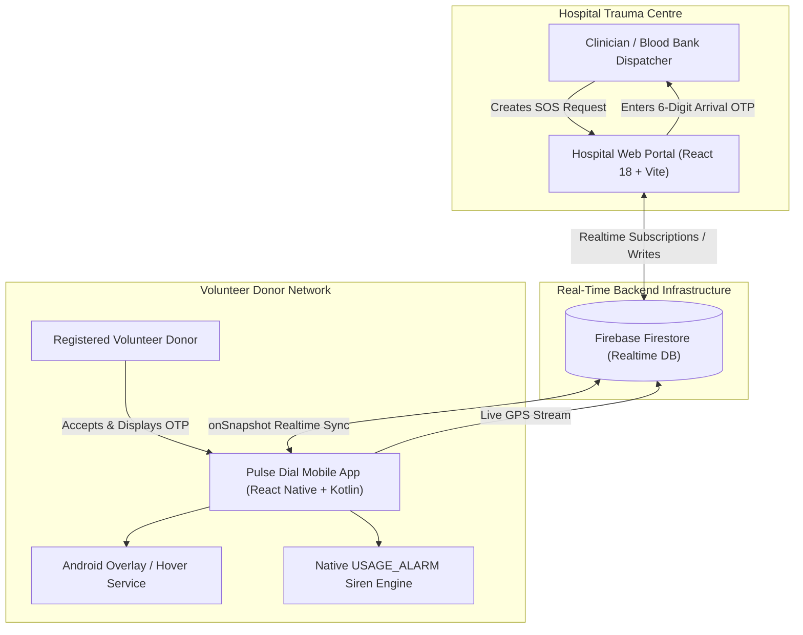
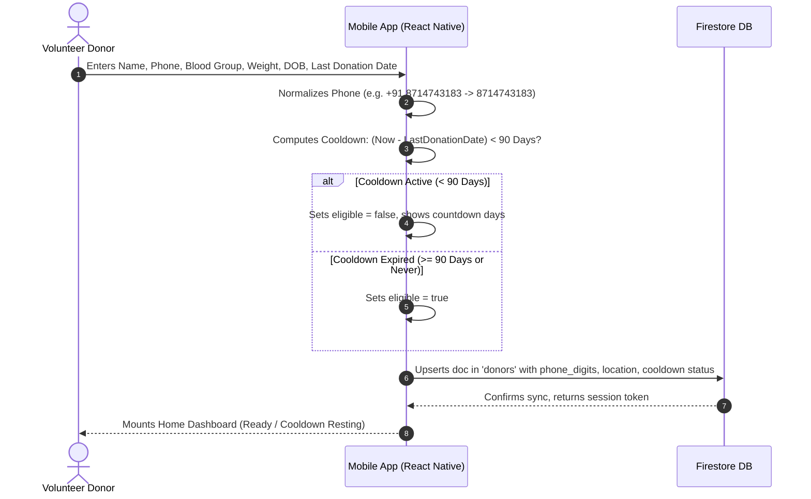
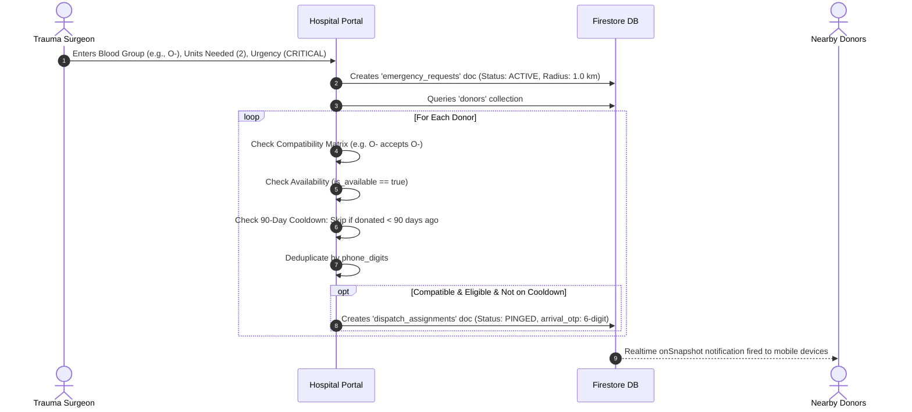
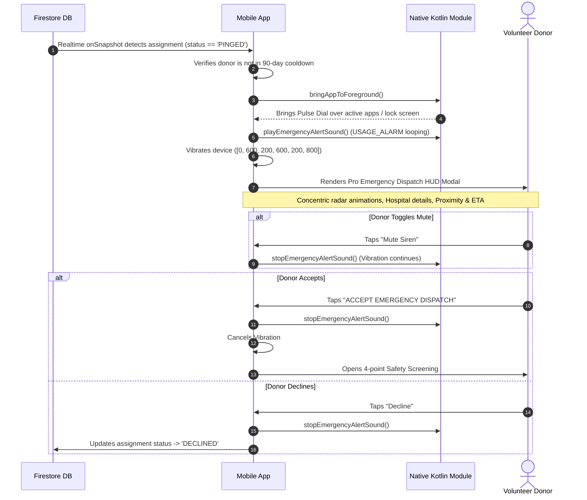
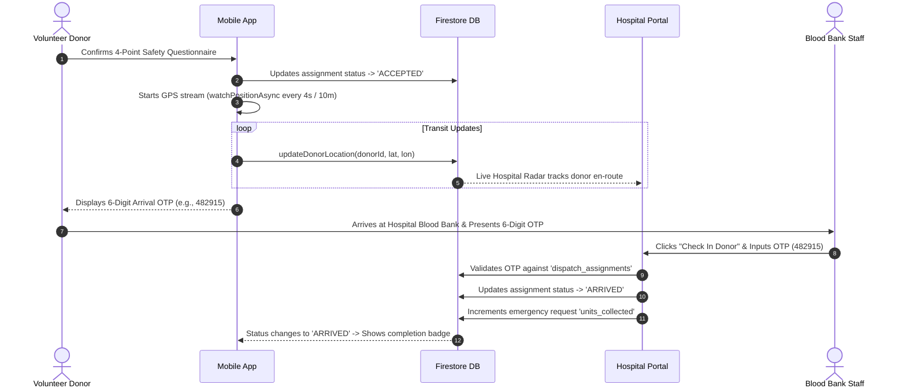

# Pulse Dial: Technical Stack & System Workflow Architecture

## 1. System Overview

**Pulse Dial** is an emergency medical blood dispatch and donor coordination network. It connects trauma hospitals, emergency response rooms, and blood banks with nearby verified volunteer donors in real time.

When an acute hemorrhage trauma occurs, hospital clinicians can initiate a localized radial dispatch for specific blood types. Nearby matching donors receive an emergency siren HUD alert on their smartphones, confirm safety screening, stream live GPS navigation, and check in at the hospital blood bank using a secure 6-digit Arrival OTP.



---

## 2. Comprehensive Tech Stack Breakdown

### 2.1 Hospital Web Portal (`apps/portal`)
- **Core Framework**: React 18.3 (Single Page Application).
- **Build Tool & Bundler**: Vite 6.4 (ESM native development, Rollup production bundling).
- **Styling**: Tailored modern CSS with dark/light themes, glassmorphic HUD overlays, responsive flex and grid layouts.
- **Icons**: Lucide React.
- **Database & Sync Client**: Firebase SDK v12.19 (Firestore real-time listeners `onSnapshot`, direct document writes `setDoc`, `updateDoc`).
- **State Management**: React state hooks (`useState`, `useEffect`, `useCallback`, `useRef`) with deduplicated subscription invalidation.
- **Deployment**: Vercel Serverless platform via root [`vercel.json`](vercel.json).

### 2.2 Donor Mobile Client (`apps/mobile`)
- **Core Framework**: React Native 0.76 with Expo Bare Workflow.
- **JavaScript Engine**: Meta Hermes Engine (Ahead-Of-Time compilation, low memory footprint).
- **Native Android Layer (Kotlin)**:
  - **`OverlayPermissionModule.kt`**:
    - **Display Over Other Apps**: Manages `Settings.canDrawOverlays` check and triggers `Settings.ACTION_MANAGE_OVERLAY_PERMISSION` intent.
    - **Foreground Launch**: Executes `Intent.FLAG_ACTIVITY_REORDER_TO_FRONT` with `FLAG_ACTIVITY_NEW_TASK` to pop the incoming emergency dispatch screen over active apps.
    - **Native Alarm Siren Engine**: Utilizes `android.media.MediaPlayer` coupled with `AudioAttributes.USAGE_ALARM` and `CONTENT_TYPE_SONIFICATION` to loop the emergency dispatch siren (`emergency_siren.wav`) even when normal media volume is silenced.
- **Audio Asset**:
  - `apps/mobile/android/app/src/main/res/raw/emergency_siren.wav`: 44.1 kHz, 16-bit Mono PCM synthesized medical dispatch siren (alternating 960 Hz / 770 Hz with smooth envelopes to eliminate audio pops).
- **Location Services**:
  - `expo-location`: Foreground & background GPS position polling, distance calculations, and real-time transit tracking.
- **Secure Persistence**:
  - `expo-secure-store`: Encrypted keystore/keychain storage for donor authentication tokens and session data.
- **Pure Domain Engine (`src/lib/`)**:
  - `donor.js`: Pure mathematical models for eligibility, age extraction, and 90-day whole-blood cooldown dates.
  - `alerts.js`: Sanitization and routing protocols for assignments and deep links.
  - `session.js`: JWT decoding, expiry projection, and session normalization.

### 2.3 Backend & Cloud Persistence
- **Primary Datastore**: **Firebase Firestore** (`pulse-dial-emergency`):
  - NoSQL document structure with real-time multi-client synchronization.
  - Granular indexing on `phone_digits`, `blood_type`, and `request_id`.
- **Secondary / Enterprise API (`services/api`)**:
  - Node.js + Express REST API with JWT bearer authorization.
  - Supabase PostgreSQL persistence support with automated bootstrap migrations.

---

## 3. End-to-End System Workflows

### 3.1 Workflow 1: Donor Registration, Normalization & 90-Day Cooldown Protection



1. **Phone Normalization**: Phone numbers are processed through `normalizePhoneDigits()`, stripping whitespace, country code variations, hyphens, and leading zeros to eliminate duplicate profile records.
2. **Medical Safety Screening**: The donor must confirm weight ($\ge 50\text{ kg}$) and age ($18\text{ to }65\text{ years}$).
3. **90-Day Whole Blood Cooldown**:
   $$\text{Days Since Donation} = \frac{\text{Current Timestamp} - \text{Last Donation Timestamp}}{86,400,000\text{ ms}}$$
   - If $\text{Days} < 90$: Donor is placed in protected cooldown. All emergency alerts are automatically suppressed on both mobile and hospital matching engines.
   - If $\text{Days} \ge 90$: Donor is marked eligible for instant dispatch.

---

### 3.2 Workflow 2: Hospital Emergency Request & Radial Geofenced Matching



- **Blood Compatibility Rules**: Matches universal and specific blood types:
  - $O- \rightarrow [O-]$
  - $O+ \rightarrow [O+, O-]$
  - $A- \rightarrow [A-, O-]$
  - $A+ \rightarrow [A+, A-, O+, O-]$
  - $B- \rightarrow [B-, O-]$
  - $B+ \rightarrow [B+, B-, O+, O-]$
  - $AB- \rightarrow [AB-, A-, B-, O-]$
  - $AB+ \rightarrow [\text{All 8 Types}]$
- **Cooldown Filter**: Donors with an active 90-day cooldown are safely skipped during assignment creation.

---

### 3.3 Workflow 3: Mobile Dispatch, Alarm Siren & Pro Tactical HUD



- **Hover / Overlay Alert**: Uses Android `Settings.ACTION_MANAGE_OVERLAY_PERMISSION` to display over any active application (e.g. YouTube, Maps, WhatsApp) or when the phone is unlocked.
- **Audio Alarm**: Plays the medical siren on the `USAGE_ALARM` audio stream, ensuring high volume and prominence.
- **Mute Control**: In-app button allows the donor to mute the siren while reviewing hospital location, units needed, and estimated drive time.

---

### 3.4 Workflow 4: Donor Acceptance, Transit Tracking & 6-Digit OTP Arrival Verification



- **Arrival Verification without Hardware Scanners**: Replaced physical QR code scanning with a clean 6-digit numerical OTP. Hospital receptionists enter the 6 digits directly in the portal to verify arrival and log the donation.

---

## 4. Firestore Database Schema Reference

### 4.1 `donors` Collection
Document ID: `donor_<phone_digits>` (e.g., `donor_918714743183`)
```json
{
  "id": "donor_918714743183",
  "full_name": "Anjo Shaju",
  "phone": "+918714743183",
  "phone_digits": "8714743183",
  "blood_type": "O-",
  "weight_kg": 68,
  "age": 26,
  "date_of_birth": "1998-05-12",
  "sex": "MALE",
  "last_donation_date": "2026-01-15",
  "medications": "None",
  "diseases": "None",
  "is_available": true,
  "reliability_score": 100,
  "lat": 10.528,
  "lon": 76.215,
  "created_at": "2026-09-15T18:00:00.000Z"
}
```

### 4.2 `emergency_requests` Collection
Document ID: `req_<timestamp>_<random>`
```json
{
  "id": "req_1789500000000_a1b2c",
  "hospital_id": "hosp_central",
  "hospital_name": "Central City Medical Centre",
  "blood_type": "O-",
  "units_required": 2,
  "units_collected": 1,
  "urgency": "CRITICAL",
  "current_tier": 1,
  "current_radius_km": 1.0,
  "lat": 10.5276,
  "lon": 76.2144,
  "status": "ACTIVE",
  "created_at": "2026-09-16T10:00:00.000Z"
}
```

### 4.3 `dispatch_assignments` Collection
Document ID: `asgn_<request_id>_<donor_id>`
```json
{
  "id": "asgn_req_1789500000000_a1b2c_donor_918714743183",
  "request_id": "req_1789500000000_a1b2c",
  "donor_id": "donor_918714743183",
  "donor_name": "Anjo Shaju",
  "donor_phone": "+918714743183",
  "donor_phone_digits": "8714743183",
  "blood_type": "O-",
  "distance_km": 1.2,
  "status": "PINGED",
  "arrival_otp": "739204",
  "hospital_name": "Central City Medical Centre",
  "units_required": 2,
  "urgency": "CRITICAL",
  "created_at": "2026-09-16T10:00:05.000Z"
}
```

---

## 5. Security, Privacy & Reliability Standards

1. **Donor Identity Privacy**:
   - Hospital dashboard masks donor contact details until the donor arrives on-site (`ARRIVED` state).
   - Pre-arrival dispatch feeds identify donors by anonymized hash avatars and proximity metrics.
2. **Clinical Safety Lockout**:
   - The 90-day cooldown logic is enforced symmetrically across both portal dispatch and mobile reception, preventing premature donations.
3. **Fail-Closed Native APK Signing**:
   - Release APK builds employ Proguard/R8 code minification and resource shrinking, stripping debug symbols and preventing APK tampering.
4. **Resilient Network Protocol**:
   - Dual-index listener architecture reconciles assignments across both document ID and normalized phone digits, preventing lost alerts during network switching.

---

## 6. Local Setup, Build & Testing Commands

### Install Dependencies
```powershell
npm install
```

### Run Development Servers
```powershell
# Hospital Web Portal (Vite on http://localhost:5173)
npm run dev:portal

# Donor Mobile App (Metro bundler)
npm run dev:mobile

# Shared API Service (http://localhost:4000)
npm run dev:api
```

### Run Tests
```powershell
# Run all workspace test suites (123 unit tests)
npm.cmd test

# Run mobile syntax verification
npm.cmd run check:mobile
```

### Build Standalone Android APK
```powershell
npm.cmd run build:apk
# Outputs release artifact: pulse-dial-donor.apk (23.85 MB)
```
